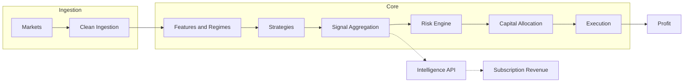

# Argus Master Plan

This document is the **single source of truth** for Argus: vision, current state, phased roadmap, strategies, regime/signal ideas, and principles. Update it whenever priorities or phases change so it stays authoritative for "what we're building and in what order."

---

## 1. Vision and Alpha

**Alpha** is the GPU engine: Heston-model Monte Carlo Probability of Profit (PoP) and IV surface anomaly detection. These are sophisticated, proprietary outputs that are safer to sell than raw price feeds. The long-term pipeline:

- **Trading pipeline:** Markets → clean ingestion → features & regimes → strategies → signal aggregation → risk engine → capital allocation → execution → profit.
- **Parallel product:** Argus Intelligence API exposes normalized bars, regimes, options intelligence, spread candidates, and signals for subscription revenue.

---

## 2. Current State

### Phase completion

| Phases | Status |
|--------|--------|
| 0–3B | **Done.** Event bus, bars, indicators, regime detection, strategy infra, timing filters, options pipeline, spread generation, tape, replay. |
| 4A Outcome Engine | **Done.** Bar outcomes, forward returns, run-up/drawdown, multi-horizon; deterministic backfills; `python -m src.outcomes`. |
| 4B Backtesting / Replay | **Done.** Replay harness, experiment runner, conservative execution model; replay packs with bars, outcomes, regimes, option snapshots. |
| 4C and beyond | **Not started.** Parameter search, portfolio risk, execution engine, strategy expansion, etc. |

### IV / snapshot / replay truth map

- **Bars and outcomes:** Alpaca (or configured bar provider).
- **Options snapshots:** Tastytrade REST (primary); **Public.com** (secondary when `public_options.enabled`). Structure can come from Tastytrade when Alpaca options is off; Public provides greeks/IV via batch API.
- **IV source:** Tastytrade: DXLink Greeks → GreeksCache → snapshot `atm_iv`. Public: Get option greeks API → snapshot `atm_iv` (canonical OSI matching, optional second source).
- **Replay:** Uses snapshot `atm_iv`; no lookahead (gating by `recv_ts_ms`).
- **Storage:** Only ATM IV persisted; no DB bloat from tick-level Greeks.
- **Health and comparison:** `scripts/options_providers_health.py` pre-checks both providers (snapshots, atm_iv %, symbols); `compare_options_snapshot_providers.py` for post-close comparison.

**Remaining risk (ordering/timing):** Outcomes depend on GreeksCache (Tastytrade) or Public greeks response being correct before snapshot publish. Cold start and illiquid symbols: E2E metrics should show `atm_iv` presence climbing after warmup. Public 0% atm_iv historically was addressed with OSI canonical matching and IV key fallback; re-validate after all-day Public runs.

---

## 3. Roadmap (Phases 0–10)

| Phase | Goal | Status | Deliverable |
|-------|------|--------|-------------|
| **0** | Deterministic data foundation | Done | Event bus, multi-exchange connectors, quote assembly, bar building, persistence, tape, replay, timestamp normalization, idempotent DB, replay determinism tests. |
| **1** | Indicator & feature engine | Done | EMA, RSI, MACD, VWAP, ATR, rolling vol, batch/incremental parity, deterministic serialization, warmup. |
| **2** | Regime detection | Done | Trend/range, volatility regimes, session classification, data quality flags, market vs symbol regimes, config hashing, restart warmup. |
| **3** | Strategy infrastructure | Done | SignalEvent schema, strategy base class, signal routing & ranking, persistence, tape capture, deterministic signal IDs. |
| **3A** | Timing filters | Done | Day-of-week, session, regime gating; deterministic emission. |
| **3B** | Options pipeline | Done | Options ingestion, chain normalization, spread generation, liquidity filtering, deterministic persistence, tape capture, replay validation. |
| **4A** | Outcome engine | Done | Forward returns, run-up, drawdown, multi-horizon outcomes, outcome DB storage, deterministic backfills. |
| **4B** | Backtesting engine | Done | Replay harness, position simulator, entry/exit modeling, transaction costs, slippage (conservative execution model). |
| **4C** | Parameter search & optimization / | **In progress** | Parameter sweeps, Monte Carlo runs, GPU simulations; **regime sensitivity scoring**, **parameter stability auto-kill**, **MC/bootstrap stress over regimes**. |
| **5** | Portfolio risk engine | Future | Position sizing, exposure limits, drawdown controls, correlation awareness, strategy budgets. |
| **6** | Execution engine | Future | Broker integration, order routing, fill simulation, paper then live trading. |
| **7** | Strategy expansion | Future | Put spread selling, volatility plays, panic snapback, FVG, session momentum, crypto–ETF relationships, Polymarket. |
| **8** | Portfolio intelligence | Future | Strategy aggregation, signal voting, dynamic allocation, regime-based capital shifts. |
| **9** | Intelligence API product | Future | Expose bars, regimes, options intelligence, spread candidates, signals for subscription revenue. |
| **10** | Self-improving system | Future | Automatic idea testing, strategy mutation, performance pruning, adaptive weighting. |

**Current status:** Research engine complete through 4B. Public options/Greeks integration done (second IV source, health script, Tastytrade-as-structure path). **Active focus:** Phase 4C —: regime sensitivity scoring, parameter stability auto-kill, MC/bootstrap stress over regimes.

---

## 4. Strategies

### Primary (chosen direction)

1. **Overnight Session Momentum / Seasonality** — *Top priority starter.*  
   Capture predictable returns across session transitions (US close → Asia open, Asia → Europe, weekend effects, crypto handovers). Fits existing session classification, deterministic bars, replay, outcome engine. Assets: BTC, BTC ETFs (IBIT, BITO), possibly SPY overnight. Simple, robust, hard to overfit.

2. **VRP — Volatility Risk Premium / Put Spread Selling** — *Core options income.*  
   Sell put spreads when IV > realized vol, market not in risk-off collapse, liquidity acceptable. Theta decay and vol overpricing. IV now injected into snapshots; replay IV parity fixed. Target: IBIT, SPY, QQQ.

3. **Statistical Mean Reversion ("1-Min Snap")** — *Research.*  
   Trade short-term dislocations (ETF vs underlying BTC, futures vs ETF). Needs multi-symbol sync and basis calculation; more complex than session or VRP.

### Secondary / backlog

- **Fair Value Gap (FVG):** Trade gaps left by impulsive moves; consolidation vs breakaway vs rejection; medium–high automation difficulty.
- **9:30–9:35 opening candle:** Breakout of first 5-minute candle; tick-sensitive, not top priority.
- **8AM candle:** Institutional premarket; mentioned, not deeply pursued.
- **Friday high/low → Monday revisit:** Pattern saved for later testing.

### Areas where Argus will likely see trouble

These regimes or conditions are hard to handle well; expect difficulty in backtest, replay, or live behavior:

- **Panic snapback** — Fast reversals; execution and fill assumptions can break.
- **Session momentum** — Cross-session effects; timing and data alignment are fragile.
- **ETF vs underlying dislocations** — Multi-symbol sync, basis, and liquidity differ by venue.
- **Volatility spikes** — Regime shifts and option liquidity can invalidate assumptions.
- **Event-driven bars** — Noise bars and non-stationary behavior; avoid training on them; need filtering.

### API business

Long-term monetization: sell spreads, signals, and options intelligence via API. Not a strategy; separate product track.

---

## 5. Regime and Signal Methodologies

| Method | Role | Priority / caution |
|-------|------|---------------------|
| **BOCPD (Bayesian Online Change-Point Detection)** | Universal regime-switch primitive; gate premium-selling when P(change) &lt; x and vol regime stable; adaptive lookback from run length. | **Implement first.** Highest signal-to-complexity; addresses regime shifts (existential risk when selling spreads). |
| **Markov / HMM regime switching** | Classify state (low-vol grind, high-vol trend, chop); map states → allowed strategy families. | Use as **one vote** among features; require confirmation from vol + microstructure; not sole driver. |
| **Hawkes / self-exciting order flow** | Microstructure “risk-on / risk-off”; shock detector; execution risk (slippage, adverse selection). | Optional until tape / order-flow depth; needs high-frequency prints. |
| **Signature transform** | Path features for regime/trend/chop classification; feed into regime gate or position sizing. | Phase 2/3; implementation complexity and overfit risk. |
| **Multifractal (MFDFA etc.)** | Risk filter: unstable scaling → reduce size / stop selling premium. | Slow-moving; weekly/monthly risk posture rather than intraday trigger. |
| **Fisher transform** | Local oscillator; Gaussianizing bounded indicators for mean-reversion thresholds. | **Feature only**, not regime gate; prone to pretty backtests that vanish after costs and regime shift. |

---

## 6. Principles (Non-Negotiables)

- **Avoid noise bars.** Not all bars are equal; prefer volume/information bars and regime filtering; event-driven bars matter for feature engineering.
- **Replay must be honest.** No mid-price fills, no lookahead bias, no optimistic fills; execution model must be pessimistic.
- **Determinism.** Same input → same output for all systems (bars, indicators, regimes, signals, outcomes).
- **Regime detection is critical.** Volatility, liquidity, risk-on/off, trend acceleration must feed strategy gating and risk.

---

## 7. How to Update This Doc

- **When a phase completes:** Set its status to Done and add a one-line “Completed: …” if useful.
- **When strategy priority changes:** Update Primary / Secondary and any implementation-order notes.
- **When adding a strategy or regime method:** Add under the right section and set status (research / planned / in progress).
- **When IV/replay/truth map changes:** Update §2 and any phase deliverable that touches snapshots or outcomes.

---

## 8. Current TODOs

**Audit summary:** The codebase audit (2026-02-12) identified two **critical bugs (fixed):** (1) cross-expiration IV contamination in `greeks_cache` (ATM IV could mix expirations); (2) DXLink Greeks streamer was never started, so `_greeks_cache` stayed empty. It also listed **10 ranked risks:** items 1–2 fixed; 3–10 open (Alpaca UTC, Deribit rate limiter, options snapshot fire-and-forget, task tracking verification, bar lock + fsync, DXLink error handling, ExecutionModel reset, secrets permissions, plus P3 backlog). One audit claim is outdated: orchestrator **does** append polling/streaming tasks to `self._tasks` in `run()`; the remaining action is to verify all `create_task` call sites are tracked and shutdown is clean (TODO 10.4).

### 8.1 Audit-derived fixes 

**P1 — Critical / This sprint**

- **10.1 Alpaca UTC timestamp parsing** — `src/connectors/alpaca_client.py`: Ensure datetime is UTC-aware before `.timestamp()` (naive → assume UTC). Add unit test.
- **10.2 Deribit rate limiter** — `src/connectors/deribit_client.py`: Replace `.seconds` with `.total_seconds()` on timedelta (lines 79, 84). Add unit test.
- **10.3 Options snapshot write retry** — `src/core/persistence.py`: Replace fire-and-forget option snapshot writes with retry pattern (e.g. 3× retry, backoff, log on final failure). Add test with mocked DB failure.
- **10.4 Orchestrator task tracking** — Verify every `asyncio.create_task()` in `src/orchestrator.py` is appended to `self._tasks` and that `stop()` cancels and awaits them. (Audit claimed tasks were not tracked; codebase now appends in `run()` — confirm no untracked tasks and that shutdown is clean.)

**P2 — High / Next sprint**

- **10.5 Disk I/O outside `_bar_lock`** — `src/core/persistence.py`: Serialize bar to JSON under lock; perform file write and `os.fsync()` outside lock to avoid blocking the bar topic worker.
- **10.6 DXLink error frame handling** — `src/connectors/tastytrade_streamer.py`: On error frame, increment counter; if persistent (>3 in 60s), trigger reconnect instead of continuing silently.
- **10.7 ExecutionModel reset in replay** — `src/analysis/replay_harness.py`: Call `self._exec.reset()` at the start of `run()` so ledger does not accumulate across runs.
- **10.8 Secrets file permissions** — `src/core/config.py`: After writing secrets file, `path.chmod(0o600)`. Add test for mode 0600.

**P3 — Medium / Backlog**

- **10.9 VRP strategy RV validation** — `src/strategies/vrp_credit_spread.py`: Guard `last_rv` against None, NaN, and negative before VRP subtraction.
- **10.10 DXLink token refresh wiring** — Wire `token_refresh_cb` on TastytradeStreamer to `get_api_quote_token()`; on exception, force reconnect.
- **10.11 GreeksCache eviction timer** — Periodic task to call `_greeks_cache.evict_stale()` (e.g. every `max_age_ms`).
- **10.12 Yahoo Finance timestamp robustness** — Reject quotes with `source_ts == 0.0`; log at WARNING.
- **10.13 Bybit WS invalid quotes** — Skip invalid quotes instead of publishing zeroed values.
- **10.14 Tastytrade snapshot NULL IV documentation** — Document in data_sources policy; add health check warning when DXLink is disconnected and Tastytrade is primary snapshot source.

### 8.2 Public API integration — **Done**

- **Public API client** — Implemented: `src/connectors/public_client.py` — auth via token exchange (`public.api_secret`), `public.account_id` required (no accounts API); 10 req/s rate limit; get_option_greeks with comma-separated OSI; 401 retry.
- **Public options connector** — Implemented: `src/connectors/public_options.py` — structure from Alpaca or Tastytrade; greeks from Public API; canonical OSI matching for response symbols; atm_iv from ATM put; Tastytrade-as-structure path fixed (AttributeError + TypeError fallback to sync path).
- **Config and secrets** — `public.api_secret`, `public.account_id`; `public.rate_limit_rps`; validation when `public_options.enabled`.
- **Health and comparison** — `scripts/options_providers_health.py` (pre-check both providers); `compare_options_snapshot_providers.py`. Tests and data_sources docs updated.

### 8.2b Kill bad strategies fast (Phase 4C — next)

- **Regime sensitivity scoring** — Score strategy/parameter sets by performance across regimes (e.g. trend vs range, low-vol vs high-vol); flag or down-rank sets that only work in one regime.
- **Parameter stability auto-kill** — Automatic flagging or removal of parameter sets that are unstable (e.g. small change in params → large change in outcome, or walk-forward failure). Integrate with experiment evaluator.
- **MC / bootstrap stress over regimes** — Monte Carlo or bootstrap runs that resample or perturb regimes; stress-test strategy robustness across regime mixes and kill sets that collapse under regime shift.

### 8.3 Strategic / product TODOs

- **Strategy allocation engine** — Strategy registry, capital competition, budget updates, promotion/demotion; consume strategy forecasts + risk estimates and output orders/target exposures under hard constraints.
- **Strategy lifecycle & kill engine** — Rolling performance metrics, degradation detection, quarantine, automatic strategy death when edge disappears.
- **Portfolio risk engine** — Exposure limits, correlation control, risk budgeting, drawdown containment. Required before safe live deployment.
- **Sizing engine (Phase 1)** — Vol-targeted fractional Kelly with caps: μ from strategy backtest (walk-forward), shrunk by confidence; σ from rolling realized vol; size = c·μ/σ² with caps and portfolio vol target; skip trades where expected edge < costs.
- **Sizing engine (Phase 2–3)** — Covariance shrinkage and portfolio risk budgeting; then drawdown probability constraints and ES monitoring.
- **Live vs backtest drift monitor** — Compare live fills vs simulated; detect slippage drift and execution degradation.
- **Strategy health monitoring** — Rolling performance, degradation alerts, quarantine engine.
- **Cross-strategy correlation analysis** — Correlation tracking and capital diversification enforcement.

### 8.4 Next steps and recommended route

**Assessment (codebase vs Master Plan):**

- **Phases 0–4B:** In place. Event bus, bars, regimes, options pipeline, outcome engine, replay harness, experiment runner, execution model, and (after audit fixes) DXLink Greeks + cross-expiration IV are the backbone. Replay packs with bars + outcomes + regimes + snapshots work; VRP strategy can consume `atm_iv` and `realized_vol` in replay.
- **Phase 4C:** In progress. `run_experiment.py --sweep` and `ExperimentRunner` support parameter grids; Optimizer variants exist. **Next:** regime-sensitivity scoring, parameter stability auto-kill, MC/bootstrap stress over regimes — unified with strategy evaluator to kill bad strategies fast.
- **Audit:** Two critical bugs fixed. P1–P3 items (timestamp parsing, rate limiter, snapshot retry, task tracking check, bar lock, DXLink errors, ExecutionModel reset, secrets permissions, VRP RV, etc.) are still open and affect correctness or operational safety.
- **Public API:** Done. Second IV/Greeks source; health script and provider comparison; reduces dependence on DXLink alone.
- **Strategic gaps:** No strategy allocation engine, no portfolio risk engine, no sizing layer, no strategy lifecycle/kill engine, no live vs backtest drift monitor. These block safe scaling and live deployment.

**Recommended next steps (ordered):**

1. **Harden data and replay (1–2 sprints)**  
   - **P1 audit fixes:** Alpaca UTC (10.1), Deribit rate limiter (10.2), options snapshot retry (10.3), confirm task tracking and shutdown (10.4).  
   - **P2 quick wins:** ExecutionModel reset at start of replay `run()` (10.7), secrets file permissions (10.8).  
   - **E2E check:** Confirm IV truth map in practice (cold start, illiquid symbols); ensure replay experiments produce non-zero VRP trades where expected.

2. **Public API for Greeks/IV (1 sprint)**  
   - Implement Public client (auth, token refresh, accountId) and Public options connector (expirations → chain → greeks → snapshot with `atm_iv`).  
   - Wire into orchestrator; add config and tests.  
   - Outcome: Second source of IV; less reliance on DXLink alone; same snapshot/replay path.

3. **Use the research engine to prove edge (ongoing)**  
   - Run VRP and (when ready) Overnight Session experiments on replay packs (multiple symbols, date ranges).  
   - Use existing `--sweep` and evaluator for parameter robustness and regime sensitivity.  
   - Document what works and what doesn’t; feed results into strategy priority (Master Plan §4) and into future allocation/sizing design.

4. **Phase 4C — (current focus)**  
   - **Regime sensitivity scoring:** Score strategy/parameter sets by performance across regimes; flag sets that only work in one regime.  
   - **Parameter stability auto-kill:** Auto-flag or kill parameter sets that are unstable (walk-forward failure, high sensitivity to param changes).  
   - **MC/bootstrap stress over regimes:** Monte Carlo or bootstrap over regime mixes; kill sets that collapse under regime shift.  
   - Optional: BOCPD or similar as regime gate for VRP (Master Plan §5).  
   - Outcome: Only strategies and parameter sets that survive robust testing get capital later.

5. **Strategy allocation and sizing (Phase 5 prelude)**   
   - Introduce a small **strategy allocation engine:** registry, forecast normalization (μ̂, σ̂, confidence), and a single-instrument sizing rule (e.g. vol-targeted fractional Kelly with caps). No broker execution yet; output is target exposure or “risk budget” per strategy/symbol.  
   - Optionally add options-spread sizing (risk budget / max loss per contract).  
   - Outcome: Clear separation “strategy says what; sizing says how much” and a path to portfolio risk (Phase 5).

6. **Portfolio risk engine (Phase 5)**  
   - Exposure limits, correlation awareness, drawdown containment, and (later) covariance shrinkage and portfolio-level vol target.  
   - Required before paper/live with real capital.

7. **Strategy lifecycle and monitoring**  
   - Rolling performance, degradation detection, quarantine, and automatic strategy death.  
   - Live vs backtest drift monitor when paper or live is in use.

**Best route going forward:**

- **Short term:** **Phase 4C —** Implement regime sensitivity scoring, parameter stability auto-kill, and MC/bootstrap stress over regimes; integrate with experiment evaluator. Keep P1/P2 audit items in backlog; E2E IV check when running both providers.  
- **Medium term:** Use the replay and experiment pipeline to **validate VRP (and session ideas)** on multiple packs and regimes with the new kill criteria. Add a **minimal allocation/sizing layer** that consumes strategy forecasts and outputs risk budgets under caps, without execution.  
- **Long term:** Add **portfolio risk engine** and **strategy lifecycle**, then paper trading and live execution. Keep the Master Plan order: allocation → lifecycle → risk engine → monitoring → paper → live → strategy expansion.

Public API is done (second IV source); focus is on killing bad strategies fast so only robust parameter sets get capital later.

---

## 9. Alpha, Sizing, and Deployment (Lessons)

Condensed from systematic-trading practice and sizing/risk discussions. Use for prioritization and design.

### 9.1 Where the first real edge comes from

- **Edge #1 — VRP (primary):** Options overpriced vs realized vol; sell put spreads when IV > RV in calm/mean-reverting regimes; avoid crash, liquidity collapse, data-lag regimes. Argus is built to test IV vs RV, spread PnL, regime dependence, drawdown paths, risk-adjusted expectancy.
- **Edge #2 — Session / flow effects (secondary):** Overnight drift, US open vol, Asia→US transition, opex, month-end. Cheap to test, often robust. Argus has session tagging and regime filters.
- **Edge #3 — ETF vs underlying dislocations:** Harder and noisier; good later, not first.

### 9.2 Sizing: non-negotiables

- **No lookahead:** Sizing uses only features available at decision time (same gating as signals/regimes/outcomes).
- **Deterministic:** Same pack + config ⇒ same size path.
- **Separation of concerns:** Strategy produces forecast; sizing decides exposure given forecast + risk + constraints.
- **Risk constraints dominate:** Sizing fails safe (reduce to zero) under uncertainty spikes, data gaps, or correlation blowups.

### 9.3 Sizing stack (practical order)

- **Layer A — Forecast normalization:** Standard object per instrument: μ̂, σ̂, edge_score, cost_hat, confidence so all strategies speak a common language.
- **Layer B — Single-instrument sizing:** Fractional Kelly (e.g. f = c·μ/σ², c ∈ [0.10, 0.50]); vol-target overlay (weight ∝ target_vol/σ); clip to ±w_max. Quarter-Kelly is a common conservative choice.
- **Layer C — Estimation error:** Shrink μ toward 0 by confidence; use covariance shrinkage for multi-asset; fractional Kelly + shrinkage + caps in practice.
- **Layer D — Portfolio sizing:** Correlation-aware risk budgeting; gross and per-instrument caps; vol-target the portfolio.
- **Layer E — Hard risk constraints:** Drawdown-aware guardrails; kill-switch (scale exposure when realized drawdown > D). ES/CVaR as monitor first, not primary optimizer.
- **Options spreads:** Size by risk budget: contracts = ⌊ risk_budget_usd / max_loss_per_contract ⌋; risk_budget_usd from portfolio-level sizing.

### 9.4 Things that kill trading systems

1. **Fake alpha from bad execution** — Mid fills, infinite liquidity, no latency. Argus: conservative fill engine, staleness/liquidity guards; keep validating live vs simulated slippage.
2. **Overfitting** — Argus: walk-forward, Monte Carlo, deterministic replay. Still needed: automatic parameter robustness scoring, kill unstable parameter sets.
3. **Strategy edge decay** — Rolling performance monitor, degradation detection, quarantine & kill engine, strategy lifecycle. Largely missing.
4. **Capital allocation mistakes** — Portfolio risk engine, allocation constraints, correlation awareness. Not implemented yet.
5. **Latency / data timing** — Argus: recv_ts_ms gating, replay barriers. Maintain strict discipline.
6. **Regime blindness** — Argus: regime detection. Still needed: tie allocation to regimes; disable strategies in hostile regimes.

### 9.5 Gaps Argus still has

- Strategy lifecycle & allocation engine (registry, capital competition, promotion/demotion, kill degraded).
- Portfolio risk engine (exposure limits, correlation, risk budgeting, drawdown containment).
- Live vs backtest drift monitor (fills, slippage, execution degradation).
- Strategy health monitoring (rolling metrics, degradation alerts, quarantine).
- Cross-strategy correlation analysis and diversification enforcement.

### 9.6 What systematic managers do well

- Kill strategies fast when edge disappears.
- Diversify alpha sources (VRP, session, structural flows, ETF dislocations, regime strategies).
- Continuous testing (walk-forward, degradation monitoring). Argus is strong here.
- Treat execution as alpha. Argus ahead of most hobby systems.

### 9.7 Argus advantages vs typical retail

- Deterministic replay (rare outside institutions).
- Honest execution modeling (most retail systems fake fills).
- Regime-aware strategies (many ignore regimes).
- Automated experiment pipeline (few independents build this).
- Options infrastructure (most retail quants avoid it).

### 9.8 Strategic build order (going forward)

1. Strategy allocation engine  
2. Strategy lifecycle management  
3. Portfolio risk engine  
4. Live vs backtest monitoring  
5. Paper trading  
6. Live execution  
7. Strategy expansion  

---

## 10. References

| Document | Description |
|----------|-------------|
| [docs/outcome_semantics.md](docs/outcome_semantics.md) | Bar outcome window definition, metrics, statuses, quantization, CLI for backfill and coverage. |
| [docs/replay_pack_and_iv_summary.md](docs/replay_pack_and_iv_summary.md) | Replay pack contents, IV from provider vs derived, checklist for replay + IV + non-zero experiments. |
| [docs/AUDIT_CODEBASE.md](docs/AUDIT_CODEBASE.md) | Full codebase audit: bugs fixed, risks ranked, concrete patch plan (P1–P3). |
| [ONBOARDING_ROADMAP.md](ONBOARDING_ROADMAP.md) | Learning path through the codebase: architecture, data flow, config, soak/tape, glossary. |
| [argus_strategy_backlog.md](argus_strategy_backlog.md) | Idea parking lot and strategy evaluation framework; master plan is authoritative for priority order. |
