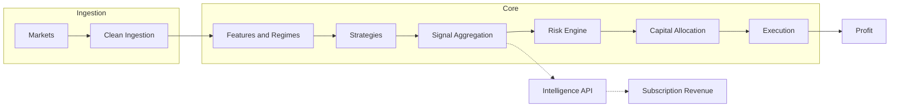

# Argus Master Plan

This document is the **single source of truth** for Argus: vision, current state, phased roadmap, strategies, regime/signal ideas, and principles. Update it whenever priorities or phases change so it stays authoritative for "what we're building and in what order."

---

## 1. Vision and Alpha

**Alpha** is the GPU engine: Heston-model Monte Carlo Probability of Profit (PoP) and IV surface anomaly detection. These are sophisticated, proprietary outputs that are safer to sell than raw price feeds.

**Terminology (for implementers):** In this document, **“Monte Carlo”** and **“MC”** appear in two distinct contexts. Do not conflate them:
- **GPU / Heston Monte Carlo** (Vision, §1): Options pricing and PoP — `gpu_engine.monte_carlo_pop_heston()`, etc. Used for alpha product (IV surface, probability of profit). Not used for strategy selection or robustness.
- **MC / bootstrap in research (Phase 4C, §8):** Robustness and kill logic only. **Not** option pricing, not Heston, not random market simulation. It **is** Monte Carlo over **realized trades or PnL paths** from replay:
  - **Monte Carlo (MC):** Take the historical trade list or PnL path from a replay run; generate many alternative paths by **resampling or reordering** those trades. From the distribution of paths, compute max drawdown distribution, ruin probability, worst-case paths, stability of returns. **Goal:** Kill strategies whose success depends on lucky sequencing.
  - **Bootstrap (preferred for trading):** Same idea but **block sampling** (e.g. stationary bootstrap of trade sequences), not iid resampling. Preserves volatility clusters, regime runs, and crash sequences for more realistic stress. Implement in `experiment_runner` / `regime_stress` / `strategy_evaluator` path.
  - **Regime-stress** (complement): Run replay per regime bucket; kill if strategy collapses in too many buckets. See §8.2b.
  - **Use:** (A) Kill fragile strategies (e.g. survives only 20% of MC paths → kill). (B) Estimate true risk: drawdown distribution, tail risk, ruin probability, realistic Sharpe range. (C) Detect parameter fragility. **Survival rule:** A strategy survives only if MC median is good, worst 5–10% paths are acceptable, and there is no ruin risk; otherwise kill.

The long-term pipeline:



- **Trading pipeline:** Markets → clean ingestion → features & regimes → strategies → signal aggregation → risk engine → capital allocation → execution → profit.
- **Parallel product:** Argus Intelligence API exposes normalized bars, regimes, options intelligence, spread candidates, and signals for subscription revenue.

---

## 2. Current State

### Phase completion

| Phases | Status |
|--------|--------|
| 0–3B | **Done.** Event bus, bars, indicators, regime detection, strategy infra, timing filters, options pipeline, spread generation, tape, replay. |
| 4A Outcome Engine | **Done.** Bar outcomes, forward returns, run-up/drawdown, multi-horizon; deterministic backfills; `python -m src.outcomes`. |
| 4B Backtesting / Replay | **Done.** Replay harness, experiment runner, conservative execution model; replay packs with bars, outcomes, regimes, option snapshots. |
| 4C Parameter search & robustness lab | **Done.** Parameter sweeps; regime sensitivity scoring (`compute_regime_sensitivity_score`); parameter stability auto-kill (`compute_robustness_penalty`, `compute_walk_forward_penalty`); MC/bootstrap on realized trades (`mc_bootstrap.run_mc_paths`, `evaluate_mc_kill`); regime-subset stress (`run_regime_subset_stress`); Strategy Research Loop (outcomes → packs → experiments → evaluation, DB pass-through, base-params merge, `require_recent_bars_hours`). Integrated in ExperimentRunner and StrategyEvaluator. |
| 4C optional (deploy gates) | **Done.** Deflated Sharpe (`deflated_sharpe.py`), Reality Check (`reality_check.py`), slippage sensitivity (`run_cost_sensitivity_sweep` + manifest integration); kill reasons in StrategyEvaluator; config via `DeployGatesOpts` / `evaluation.deploy_gates`. |
| 5 Prelude (sizing and allocation) | **Done.** Forecast/sizing (`sizing.py`: fractional Kelly, vol-target overlay, `contracts_from_risk_budget`, confidence shrinkage); StrategyRegistry (`strategy_registry.py`); AllocationEngine (`allocation_engine.py`: per-play cap 7%, aggregate cap, optional vol target); config via `AllocationOpts` / `evaluation.allocation`. Research loop calls registry and allocation when config set; persists `allocations.json`. Optional `max_loss_per_contract` (float or per-strategy map) for options sizing. |

### IV / snapshot / replay truth map

- **Bars and outcomes:** Alpaca (or configured bar provider). **Alpaca is bars and outcomes only** — it does not provide IV, greeks, or option data; policy is enforced: `options_snapshots_primary` may only be `tastytrade` or `public` (see `src/core/data_sources.py`). VRP strategy never uses Alpaca for IV.
- **Options snapshots:** Tastytrade REST (primary); **Public.com** (secondary when `public_options.enabled`). Structure from Tastytrade; Public provides greeks/IV via batch API.
- **IV consolidation:** A single **IVConsensusEngine** ([src/core/iv_consensus.py](src/core/iv_consensus.py)) consolidates IV and Greeks from (1) DXLink streamed events and (2) public/Tastytrade snapshots. It is expiry-aware (no cross-expiration bleed), time-gated by `recv_ts_ms`, and exposes configurable policies: `prefer_dxlink` (default), `winner_based`, `blended`. Discrepancy scoring and structured logs surface quality and provenance for monitoring.
- **Enrichment path:** Snapshot enrichment ([src/core/greeks_cache.py](src/core/greeks_cache.py) `enrich_snapshot_iv`) prefers the consensus engine when the passed object has `get_atm_consensus`; returns ATM IV from consensus. Legacy path (GreeksCache `get_atm_iv`) is used only when the object has `get_atm_iv` (e.g. tests or a dual cache); orchestrator passes the engine only, so no cross-expiration fallback and no use of legacy cache in production.
- **Orchestrator:** Instantiates `IVConsensusEngine`, feeds DXLink via `observe_dxlink_greeks`, public/Tastytrade snapshots via `observe_public_snapshot`, and enriches with consensus. Strategy-facing helpers: `get_consensus_atm_iv`, `get_consensus_contract_iv`.
- **Replay:** Uses snapshot `atm_iv`; no lookahead (gating by `recv_ts_ms`).
- **Storage:** Only ATM IV persisted; no DB bloat from tick-level Greeks.
- **Health and comparison:** `scripts/options_providers_health.py` pre-checks both providers (snapshots, atm_iv %, symbols); `compare_options_snapshot_providers.py` for post-close comparison.
- **Sprint 2 E2E verifier:** `scripts/verify_vrp_replay.py` builds a replay pack, runs VRPCreditSpreadStrategy, prints bars/outcomes/snapshots/trade counts, and exits non-zero with actionable diagnostics when trade count is zero (missing outcomes/IV/snapshots, provider mismatch, gating). [docs/replay_pack_and_iv_summary.md](docs/replay_pack_and_iv_summary.md) documents the Sprint 2 E2E checklist and results (2026-02-13).

**Remaining risk (ordering/timing):** Cold start and illiquid symbols are covered by the E2E verifier and checklist; discrepancy rollup (`get_discrepancy_rollup`) is available for monitoring. Public 0% atm_iv historically was addressed with OSI canonical matching and IV key fallback; re-validate after all-day Public runs.

### Global risk flow (implemented)

- **Computation:** [src/core/global_risk_flow.py](src/core/global_risk_flow.py) — `compute_global_risk_flow()`: 0.4×AsiaReturn + 0.4×EuropeReturn + 0.2×FXRiskSignal. Asia: EWJ, FXI, EWT, EWY, INDA; Europe: EWG, EWU, FEZ, EWL; FX: USD/JPY. Weights redistribute when components are missing; no lookahead (bar_ts &lt; sim_time).
- **Updater:** [src/core/global_risk_flow_updater.py](src/core/global_risk_flow_updater.py) — DB-only; reads `market_bars` via `get_bars_daily_for_risk_flow`; publishes `ExternalMetricEvent` to `TOPIC_EXTERNAL_METRICS`; no live Alpha Vantage API calls at update time. Gated by `exchanges.alphavantage.enabled`.
- **Data:** [src/connectors/alphavantage_collector.py](src/connectors/alphavantage_collector.py) — Daily batch at 09:00 ET; 14 symbols (10 ETFs + 4 FX) into `market_bars`; feeds updater. Database: `get_bars_daily_for_risk_flow(source, symbols, end_ms, lookback_days)`.
- **Regime integration:** Regime detector subscribes to external metrics; merges `global_risk_flow` into `metrics_json` on emission. Replay pack injects into regimes deterministically from DB bars.
- **Strategy gating:** Overnight strategy uses `gate_on_risk_flow` and `min_global_risk_flow` from `visible_regimes`.
- **Orchestrator:** Instantiates updater; periodic loop (`external_metrics_interval_seconds`); exposes `get_global_risk_flow()`.
- **Tests:** [tests/test_global_risk_flow.py](tests/test_global_risk_flow.py), [tests/test_global_risk_flow_updater.py](tests/test_global_risk_flow_updater.py).

---

## 3. Roadmap (Phases 0–10)

| Phase | Goal | Status | Deliverable |
|-------|------|--------|-------------|
| **0** | Deterministic data foundation | Done | Event bus, multi-exchange connectors, quote assembly, bar building, persistence, tape, replay, timestamp normalization, idempotent DB, replay determinism tests. |
| **1** | Indicator & feature engine | Done | EMA, RSI, MACD, VWAP, ATR, rolling vol, batch/incremental parity, deterministic serialization, warmup. |
| **2** | Regime detection | Done | Trend/range, volatility regimes, session classification, data quality flags, market vs symbol regimes, config hashing, restart warmup. |
| **3** | Strategy infrastructure | Done | SignalEvent schema, strategy base class, signal routing & ranking, persistence, tape capture, deterministic signal IDs. |
| **3A** | Timing filters | Done | Day-of-week, session, regime gating; deterministic emission. |
| **3B** | Options pipeline | Done | Options ingestion, chain normalization, spread generation, liquidity filtering, deterministic persistence, tape capture, replay validation. |
| **4A** | Outcome engine | Done | Forward returns, run-up, drawdown, multi-horizon outcomes, outcome DB storage, deterministic backfills. |
| **4B** | Backtesting engine | Done | Replay harness, position simulator, entry/exit modeling, transaction costs, slippage (conservative execution model). |
| **4C** | Parameter search & robustness lab | **Done** | Parameter sweeps (incl. **auto parameter grid**: sweep YAML range specs, `expand_sweep_grid`, `config/vrp_sweep.yaml`); regime sensitivity scoring; parameter stability auto-kill; MC/bootstrap on realized trades; regime-subset stress; Strategy Research Loop. Deploy gates done: DSR, Reality Check, slippage sensitivity. |
| **5** | Portfolio risk engine | **Prelude done** | Sizing stack (Forecast, fractional Kelly, vol target, options contracts), StrategyRegistry, AllocationEngine. **Full Phase 5 (future):** Exposure limits, correlation, drawdown containment, strategy budgets. Black–Scholes (or existing Greeks): delta/vega for exposure and implementation shortfall, not a separate phase. |
| **6** | Execution engine | Future | Broker integration, order routing, fill simulation, paper then live trading. TCA ledger (decision price, arrival, NBBO, executed, spread paid). |
| **7** | Strategy expansion | Future | Put spread selling, volatility plays, panic snapback, FVG, session momentum, crypto–ETF relationships, Polymarket. |
| **8** | Portfolio intelligence | Future | Strategy aggregation, signal voting, dynamic allocation, regime-based capital shifts. **StrategyLeague** (tournament allocator): eligibility gate, smoothed weight updates, degradation detector, kill/quarantine; allocate from health metrics not raw short-run PnL. |
| **9** | Intelligence API product | Future | Expose bars, regimes, options intelligence, spread candidates, signals for subscription revenue. |
| **10** | Self-improving system | Future | Automatic idea testing, strategy mutation, performance pruning, adaptive weighting. |

**Where we are now:** Phase 4C including deploy gates and **auto parameter grid** (sweep range expansion, `config/vrp_sweep.yaml`) is done. Phase 5 prelude (sizing, registry, allocation engine, research–allocation loop, max_loss_per_contract) is done. IV consolidation is done. **Global risk flow** is implemented (computation, DB-only updater, regime merge, replay injection, overnight gating). **Alpaca = bars/outcomes only** is enforced (no IV/options from Alpaca; data_sources allowed options providers = tastytrade, public). P1/P2 audit items (10.2, 10.4, 10.7, 10.8) verified. Sprint 2 E2E check done; secrets path in tests uses `config/secrets.yaml`. **Next:** See §8.4 (Your next steps, Claude recommendation).

---

## 4. Strategies

### Primary (chosen direction)

1. **Overnight Session Momentum / Seasonality** — *Top priority starter.*  
   Capture predictable returns across session transitions (US close → Asia open, Asia → Europe, weekend effects, crypto handovers). Fits existing session classification, deterministic bars, replay, outcome engine. Assets: BTC, BTC ETFs (IBIT), liquid ETF universe, SPY overnight. Simple, robust, hard to overfit.

2. **VRP — Volatility Risk Premium / Put Spread Selling** — *Core options income.*  
   Sell put spreads when IV > realized vol, market not in risk-off collapse, liquidity acceptable. Theta decay and vol overpricing. IV now injected into snapshots; replay IV parity fixed. Target: IBIT, SPY, QQQ.

3. **Statistical Mean Reversion ("1-Min Snap")** — *Research.*  
   Trade short-term dislocations (ETF vs underlying BTC, futures vs ETF). Needs multi-symbol sync and basis calculation; more complex than session or VRP.

### Secondary / backlog

- **Fair Value Gap (FVG):** Trade gaps left by impulsive moves; consolidation vs breakaway vs rejection; medium–high automation difficulty.
- **9:30–9:35 opening candle:** Breakout of first 5-minute candle; tick-sensitive, not top priority.
- **8AM candle:** Institutional premarket; mentioned, not deeply pursued.
- **Friday high/low → Monday revisit:** Pattern saved for later testing.

### Areas where Argus will likely see trouble

These regimes or conditions are hard to handle well; expect difficulty in backtest, replay, or live behavior:

- **Panic snapback** — Fast reversals; execution and fill assumptions can break.
- **Session momentum** — Cross-session effects; timing and data alignment are fragile.
- **ETF vs underlying dislocations** — Multi-symbol sync, basis, and liquidity differ by venue.
- **Volatility spikes** — Regime shifts and option liquidity can invalidate assumptions.
- **Event-driven bars** — Noise bars and non-stationary behavior; avoid training on them; need filtering.

### API business

Long-term monetization: sell spreads, signals, and options intelligence via API. Not a strategy; separate product track.

---

## 5. Regime and Signal Methodologies

### 5.0 Feature inputs to regime detection

Regime detection consumes **feature layers**, not raw market data alone:

```
Raw market data → Features (session returns, FX moves, vol, global risk flow) → Regime detection → Strategy selection & sizing
```

**Global risk flow** is a compressed summary of how Asia + Europe + FX moved before the US session. It answers “where does pressure come from?” rather than “what did SPY do?” — e.g. Asia sold overnight, Europe flat, USD/JPY falling (risk-off) → global risk flow &lt; 0 → US open likely weak, vol higher. **Implemented.** Core logic in [src/core/global_risk_flow.py](src/core/global_risk_flow.py) (0.4×AsiaReturn + 0.4×EuropeReturn + 0.2×FXRiskSignal); `GlobalRiskFlowUpdater` fetches daily bars from DB (DB-only, no live AV calls), publishes `ExternalMetricEvent`; regime detector merges into `metrics_json`; replay pack injects into regimes deterministically; Overnight strategy gates via `gate_on_risk_flow` / `min_global_risk_flow`. Data: Alpha Vantage daily batch (14 symbols) via [alphavantage_collector.py](src/connectors/alphavantage_collector.py); `get_bars_daily_for_risk_flow` in DB. Gated by `exchanges.alphavantage.enabled`. Helps VRP timing (vol overpriced after risk-off) and overnight strategy gating. See [OVERNIGHT_SESSION_STRATEGY_PLAN.md](docs/OVERNIGHT_SESSION_STRATEGY_PLAN.md) §5.

### 5.1 Regime methods

| Method | Role | Priority / caution |
|-------|------|---------------------|
| **BOCPD (Bayesian Online Change-Point Detection)** | Universal regime-switch primitive; gate premium-selling when P(change) &lt; x and vol regime stable; adaptive lookback from run length. | **Implement first.** Highest signal-to-complexity; addresses regime shifts (existential risk when selling spreads). |
| **Markov / HMM regime switching** | Classify state (low-vol grind, high-vol trend, chop); map states → allowed strategy families. | Use as **one vote** among features; require confirmation from vol + microstructure; not sole driver. |
| **Hawkes / self-exciting order flow** | Microstructure “risk-on / risk-off”; shock detector; execution risk (slippage, adverse selection). | Optional until tape / order-flow depth; needs high-frequency prints. |
| **Signature transform** | Path features for regime/trend/chop classification; feed into regime gate or position sizing. | Phase 2/3; implementation complexity and overfit risk. |
| **Multifractal (MFDFA etc.)** | Risk filter: unstable scaling → reduce size / stop selling premium. | Slow-moving; weekly/monthly risk posture rather than intraday trigger. |
| **Fisher transform** | Local oscillator; Gaussianizing bounded indicators for mean-reversion thresholds. | **Feature only**, not regime gate; prone to pretty backtests that vanish after costs and regime shift. |

---

## 6. Principles (Non-Negotiables)

- **Avoid noise bars.** Not all bars are equal; prefer volume/information bars and regime filtering; event-driven bars matter for feature engineering.
- **Replay must be honest.** No mid-price fills, no lookahead bias, no optimistic fills; execution model must be pessimistic.
- **Determinism.** Same input → same output for all systems (bars, indicators, regimes, signals, outcomes).
- **Regime detection is critical.** Volatility, liquidity, risk-on/off, trend acceleration must feed strategy gating and risk.
- **Deploy gates.** No deploy if multiple-testing corrected metrics fail; no deploy if slippage sensitivity shows edge disappears; no deploy if performance is localized to one regime/fold. Strategy versioning: treat strategy changes as new hypotheses.

---

## 7. How to Update This Doc

- **When a phase completes:** Set its status to Done and add a one-line “Completed: …” if useful.
- **When strategy priority changes:** Update Primary / Secondary and any implementation-order notes.
- **When adding a strategy or regime method:** Add under the right section and set status (research / planned / in progress).
- **When IV/replay/truth map changes:** Update §2 and any phase deliverable that touches snapshots or outcomes.

---

## 8. Current TODOs


**Audit summary:** The codebase audit (2026-02-12) identified three **critical bugs (fixed):** (1) cross-expiration IV contamination in `greeks_cache` (ATM IV could mix expirations); (2) DXLink Greeks streamer was never started, so `_greeks_cache` stayed empty; (3) enrichment fallback crash: when the orchestrator passed `IVConsensusEngine` to `enrich_snapshot_iv` and consensus returned no IV for both put and call, the code called `greeks_cache.get_atm_iv()` which the engine does not implement, causing `AttributeError` — fixed by gating the legacy path on `hasattr(greeks_cache, "get_atm_iv")`. It also listed **10 ranked risks:** items 1–2 fixed; 3–10 open (Alpaca UTC, Deribit rate limiter, options snapshot fire-and-forget, task tracking verification, bar lock + fsync, DXLink error handling, ExecutionModel reset, secrets permissions, plus P3 backlog). One audit claim is outdated: orchestrator **does** append polling/streaming tasks to `self._tasks` in `run()`; the remaining action is to verify all `create_task` call sites are tracked and shutdown is clean (TODO 10.4).

### 8.1 Audit-derived fixes 

**P1 — Critical / This sprint**

- **10.1 Alpaca UTC timestamp parsing** — **Fixed.** Naive datetimes treated as UTC in `alpaca_client.py` before `.timestamp()`.
- **10.2 Deribit rate limiter** — `src/connectors/deribit_client.py`: Replace `.seconds` with `.total_seconds()` on timedelta (lines 79, 84). Add unit test.
- **10.3 Options snapshot write retry** — **Fixed.** `persistence.py` option chain snapshot write uses 3× retry with exponential backoff.
- **10.4 Orchestrator task tracking** — Verify every `asyncio.create_task()` in `src/orchestrator.py` is appended to `self._tasks` and that `stop()` cancels and awaits them. (Audit claimed tasks were not tracked; codebase now appends in `run()` — confirm no untracked tasks and that shutdown is clean.)

**P2 — High / Next sprint**

- **10.5 Disk I/O outside `_bar_lock`** — `src/core/persistence.py`: Serialize bar to JSON under lock; perform file write and `os.fsync()` outside lock to avoid blocking the bar topic worker.
- **10.6 DXLink error frame handling** — `src/connectors/tastytrade_streamer.py`: On error frame, increment counter; if persistent (>3 in 60s), trigger reconnect instead of continuing silently.
- **10.7 ExecutionModel reset in replay** — **Done.** `replay_harness.py` calls `self._exec.reset()` at start of `run()`; `tests/test_replay_reset.py` verifies.
- **10.8 Secrets file permissions** — **Done.** `config.py` calls `path.chmod(0o600)` after writing secrets; `tests/test_secrets_permissions.py` verifies (Windows-accepting 0o666 where chmod does not change st_mode).

**P3 — Medium / Backlog**

- **10.9 VRP strategy RV validation** — `src/strategies/vrp_credit_spread.py`: Guard `last_rv` against None, NaN, and negative before VRP subtraction.
- **10.10 DXLink token refresh wiring** — Wire `token_refresh_cb` on TastytradeStreamer to `get_api_quote_token()`; on exception, force reconnect.
- **10.11 GreeksCache eviction timer** — Periodic task to call `_greeks_cache.evict_stale()` (e.g. every `max_age_ms`).
- **10.12 Yahoo Finance timestamp robustness** — Reject quotes with `source_ts == 0.0`; log at WARNING.
- **10.13 Bybit WS invalid quotes** — Skip invalid quotes instead of publishing zeroed values.
- **10.14 Tastytrade snapshot NULL IV documentation** — Document in data_sources policy; add health check warning when DXLink is disconnected and Tastytrade is primary snapshot source.

### 8.2 Public API integration — **Done**

- **Public API client** — Implemented: `src/connectors/public_client.py` — auth via token exchange (`public.api_secret`), `public.account_id` required (no accounts API); 10 req/s rate limit; get_option_greeks with comma-separated OSI; 401 retry.
- **Public options connector** — Implemented: `src/connectors/public_options.py` — structure from Alpaca or Tastytrade; greeks from Public API; canonical OSI matching for response symbols; atm_iv from ATM put; Tastytrade-as-structure path fixed (AttributeError + TypeError fallback to sync path).
- **Config and secrets** — `public.api_secret`, `public.account_id`; `public.rate_limit_rps`; validation when `public_options.enabled`.
- **Health and comparison** — `scripts/options_providers_health.py` (pre-check both providers); `compare_options_snapshot_providers.py`. Tests and data_sources docs updated.

### 8.2a Phase 4C — **Done** (verified 2026-02-12)

- **Regime sensitivity scoring** — `compute_regime_sensitivity_score()` in `strategy_evaluator.py`; integrated into composite score.
- **Parameter stability auto-kill** — `compute_robustness_penalty()` (parameter fragility across sweeps), `compute_walk_forward_penalty()` (walk-forward instability); kill thresholds in StrategyEvaluator.
- **MC/bootstrap on realized trades** — `src/analysis/mc_bootstrap.py` (`run_mc_paths`, `evaluate_mc_kill`); ExperimentRunner runs MC after replay, attaches to manifest; StrategyEvaluator applies MC kill reasons.
- **Regime-subset stress** — `run_regime_subset_stress()` in `regime_stress.py`; run_experiment.py `--regime-stress`; Strategy Research Loop runs it per strategy.
- **Strategy Research Loop** — `scripts/strategy_research_loop.py`; outcomes → packs → experiments → evaluation; DB pass-through, base-params merge, require_recent_bars_hours.

### 8.2b Phase 4C deploy gates — Done

- **Deflated Sharpe Ratio** — `src/analysis/deflated_sharpe.py` (threshold SR, DSR formula with skew/kurtosis); StrategyEvaluator `_compute_dsr_for_all()`, kill reason `dsr_below_threshold`.
- **Reality Check (White's SPA-style)** — `src/analysis/reality_check.py` (stationary bootstrap, HAC variance); evaluator kill reason `reality_check_failed` when p_value >= threshold.
- **Slippage sensitivity** — `ExecutionConfig.cost_multiplier`; `ExperimentRunner.run_cost_sensitivity_sweep()` (1x, 1.25x, 1.5x); sweep result written into baseline artifact manifest; evaluator kill reason `slippage_sensitivity` when killed.
- **Config** — `research_loop_config.DeployGatesOpts`; YAML `evaluation.deploy_gates` (dsr_min, reality_check_p_max, etc.).
### 8.3 Strategic / product TODOs

- **Strategy allocation engine (StrategyLeague)** — **Minimal allocation engine — Done.** `StrategyRegistry`, `AllocationEngine`, `AllocationConfig`; consumes `Forecast` list, outputs target weights/contracts with per-play cap (7%) and aggregate cap. **Still to do (StrategyLeague):** capital competition, smoothed weight updates, degradation detector, eligibility gate in production loop.
- **Strategy lifecycle & kill engine** — Rolling performance metrics, degradation detection, quarantine, automatic strategy death when edge disappears. Kill triggers: rolling expectancy beyond confidence bounds, slippage/lag spikes, drawdown regime breach, data distribution shift.
- **Portfolio risk engine** — Exposure limits, correlation control, risk budgeting, drawdown containment. **Per-play cap:** e.g. ≤7% of equity per play (one position or correlated cluster); portfolio caps for sector/underlying/vega concentration. Required before safe live deployment. Tests: e.g. test_risk_caps.py (allocator clamps when multiple signals try to exceed caps).
- **Sizing engine (Phase 1)** — **Done.** `sizing.py`: Forecast, `fractional_kelly_size`, `vol_target_overlay`, `contracts_from_risk_budget`, `shrink_mu`, `size_position`. Quarter-Kelly, caps, vol target, confidence shrinkage. **Phase 2–3** (covariance shrinkage, portfolio risk budgeting) remains future.
- **Sizing engine (Phase 2–3)** — Covariance shrinkage and portfolio risk budgeting; then drawdown probability constraints and ES monitoring. Two allocators: simple vol-scaling/risk-budget baseline; shrinkage-covariance allocator for multi-strategy. Tests: test_allocator_numerics.py (PSD covariance, weight sum constraints).
- **Black–Scholes / Greeks usage** — Use for risk (delta/vega, max vega per underlying), IV/VRP inputs (already in use), and implementation shortfall (decision vs execution). Not a separate phase; part of execution and risk caps.
- **Live vs backtest drift monitor** — Compare live fills vs simulated; detect slippage drift and execution degradation. Alert if realized slippage exceeds backtest assumption by Yσ → quarantine strategy.
- **Strategy health monitoring** — Rolling performance, degradation alerts, quarantine engine.
- **Cross-strategy correlation analysis** — Correlation tracking and capital diversification enforcement.

### 8.4 Next steps and recommended route

**Status (as of 2026-02-13)**

- **Sprint 1:** Done + verified (research–allocation loop, P1 audit 10.2/10.4, config/allocation/max_loss_per_contract).
- **Sprint 2 code tasks:** Done + verified (ExecutionModel reset, secrets file permissions; secrets-permissions test fixed for Windows).
- **Sprint 2 E2E check:** Done + verified. Repeatable verifier `scripts/verify_vrp_replay.py`; [docs/replay_pack_and_iv_summary.md](docs/replay_pack_and_iv_summary.md) Sprint 2 E2E section; IV consensus deterministic test.
- **Auto parameter grid:** Done. `src/analysis/sweep_grid.py` (`expand_sweep_grid`); range specs in sweep YAML; integration in `strategy_research_loop.py`; `config/vrp_sweep.yaml`; docs in [docs/strategy_research_loop.md](docs/strategy_research_loop.md); [docs/PLAN_AUTO_PARAMETER_GRID.md](docs/PLAN_AUTO_PARAMETER_GRID.md) completion summary.
- **Alpaca = bars/outcomes only:** Done. `_ALLOWED_OPTIONS_SNAPSHOT_PROVIDERS` excludes alpaca; VRP strategy never uses Alpaca for IV; no `allow_alpaca_iv`; tests and configs updated.

**Assessment (codebase vs Master Plan):**

- **Phases 0–4B:** In place. Event bus, bars, regimes, options pipeline, outcome engine, replay harness, experiment runner, execution model, DXLink Greeks + IV consensus. Replay packs work; VRP consumes `atm_iv` and `realized_vol` from Tastytrade/Public only.
- **Global risk flow:** Implemented. Core computation, DB-only updater, regime merge, replay injection, Overnight strategy gating; Alpha Vantage collector populates `market_bars`; see §2.
- **Phase 4C:** Done. Regime sensitivity, parameter stability auto-kill, MC/bootstrap, regime-subset stress, Strategy Research Loop, deploy gates, **and sweep range expansion** — all integrated.
- **Audit:** Critical bugs fixed; P1/P2 verified. Research loop runs allocation and persists allocations when config set.
- **Public API:** Done. Strategic gaps: full portfolio risk engine, strategy lifecycle/kill engine, live vs backtest drift monitor, execution/slippage measurement (see below).

---

**Your next steps (prioritized)**

1. **Overnight Session Strategy — Phase 1** — **Done.** `OvernightSessionStrategy` is implemented in `src/strategies/overnight_session.py` (ReplayStrategy: `on_bar`, `generate_intents`, session transitions, visible outcomes, risk-flow gating). Wired in `_STRATEGY_MODULES`, `config/research_loop.yaml`, `config/overnight_sweep.yaml`; unit tests in `tests/test_overnight_session.py`.

2. **Ongoing research (continuous)**  
   Run the research engine: VRP sweeps (`config/vrp_sweep.yaml`), **overnight experiments** (`config/overnight_sweep.yaml`). Document findings; feed into strategy priority and allocation design.

3. **Optional follow-ups (good next Claude tasks)**  
   - **Overnight Phase 2:** Global ETF proxies + Alpha Vantage (see [OVERNIGHT_SESSION_STRATEGY_PLAN.md](docs/OVERNIGHT_SESSION_STRATEGY_PLAN.md)).  
   - **P2/P3 audit:** 10.5 (bar lock/fsync), 10.6 (DXLink error handling), 10.9 (VRP RV validation), etc.  
   - **Execution/slippage roadmap** (§8.4 below): paper broker interface, independent slippage measurement, backtest calibration loop.  
   - **Phase 5 full:** Portfolio risk engine (exposure limits, correlation, drawdown containment).

---

**Using Claude for a larger task (recommendation)**

Past implementations (auto parameter grid, Alpaca policy, research–allocation loop, P1/P2 audit, **Overnight Phase 1**) are in place and verified. **Solidifying is in good shape.**

**Best use of Claude now:** Pick one of: **Overnight Phase 2** (global ETFs, Alpha Vantage), **Phase 5 full** (portfolio risk engine), or **execution/slippage measurement** (paper broker + slippage capture). All are larger and less bounded than Phase 1; Overnight Phase 2 is the most scoped of the three.

---

**1) Sprint 2 E2E check — Done (2026-02-13)**

- **Delivered:** `scripts/verify_vrp_replay.py` (--symbol, --start, --end, --provider, --pack_out, --db); builds pack, runs VRP, prints bars/outcomes/snapshots/trade_count; exits 1 with actionable diagnostics when trade_count is zero. [docs/replay_pack_and_iv_summary.md](docs/replay_pack_and_iv_summary.md) updated with Sprint 2 E2E results: commands, output summary, pass criteria, issues/fixes, verifier usage. Deterministic IV consensus test in `tests/test_iv_consensus_engine.py` for high-discrepancy winner_based (selected_source=dxlink, iv_quality=bad).

- **Goals met:** (A) IV truth map — cold start, illiquid discrepancy, DXLink path covered by verifier and consensus tests. (B) Replay VRP — verifier fails fast with clear reasons when bars/outcomes/snapshots/IV or gating cause zero trades.

---

**2) Next: Ongoing research (continuous)**

Use the research engine to prove edge: VRP experiments (IBIT/SPY/QQQ), Overnight/session experiments. Document findings and feed into strategy priority and allocation design (and later portfolio risk). No new implementation required beyond iterative strategy research + writeups.

---

**3) Future phases (separate plans when prioritized)**

- **Portfolio risk engine (Phase 5 full):** Exposure limits, correlation, drawdown containment, cov shrinkage, portfolio vol target.
- **Strategy lifecycle:** Rolling health, degradation detection, quarantine/kill.
- **Live vs backtest drift monitor:** Slippage drift alerts.
- **StrategyLeague enhancements:** Capital budgeting, diversity-aware ranking, lifecycle integration.

High-level scope remains in [docs/MEDIUM_TERM_SCOPE.md](docs/MEDIUM_TERM_SCOPE.md).

---

**4) Execution and slippage measurement roadmap (paper-first, broker-backed)**

So that paper trading produces calibratable costs, not just “broker paper fills”:

- **Phase 4A — Execution interface (minimal abstraction)**  
  Add/confirm a stable interface: `place_order(order) -> order_id`, `cancel(order_id)`, `poll_events() -> fills/rejects`, `get_positions()`. Implementations: PaperBroker (optional internal), AlpacaPaperBroker (recommended first), (later) other broker adapters.

- **Phase 4B — Independent slippage measurement (required even with broker paper)**  
  For every order: capture quote at order time (bid/ask snapshot, recv_ts_ms); capture broker fill price and fill timestamp; compute slippage vs expected model (mid, bid/ask, etc.); persist as structured events + daily rollups.

- **Phase 4C — Backtest calibration loop**  
  Feed measured slippage distributions back into execution model assumptions; re-run replay experiments with calibrated costs.

Broker paper is useful for lifecycle and constraints, but paper fills are often optimistic. Independent measurement turns it into real signal.

### 8.5 Research-to-deploy pipeline and invariants

Discovery and deployment follow a single pipeline. Each stage has contracts and tests.

- **Data ingest** — Bars, options chains, greeks, account. **Data QA gates:** completeness, staleness, symbol integrity. Staleness guards: if IV/greeks older than threshold → no trade. Time-consistency: no strategy can access greeks whose receipt timestamp exceeds sim time (lookahead hazard). Monitor per-provider lag in live and replay.
- **Feature store** — Price, options, relval, regimes. **Global risk flow** (Asia/Europe return, FX risk signal) is implemented and merged into regime `metrics_json`; see §2 (Global risk flow), Overnight Session Strategy Plan. **Feature invariants:** no NaNs after warmup; monotonic time indices; no dependence on future bars/snapshots. Tests: e.g. tests/test_feature_leakage.py. Separate feature computation from strategy logic (e.g. src/features/).
- **Strategy factory** — **Strategy family constraints:** define allowable instruments, max trading frequency, max parameter count, invariant risk constraints. Tests: e.g. tests/test_strategy_constraints.py reject strategies exceeding parameter-count or turnover budget.
- **Replay backtests** — Conservative fills + barriers (existing). Outcomes/labels: all label horizons respected; purging/embargo in train/test splits when labels depend on future. Tests: e.g. tests/test_cv_embargo.py (training excludes overlapping label ranges).
- **Robustness lab** — Walk-forward, **MC/bootstrap on realized trades** (replay → trade list → resample/reorder paths → distribution; block bootstrap preferred; not GPU Monte Carlo), **regime-stress** runs, slippage sensitivity sweeps. Kill criteria: e.g. survives only low % of paths, worst 5–10% paths unacceptable, ruin risk, probability edge ≤ 0 net of costs.
- **Selection gate** — Multiple-testing correction, DSR, Reality Check/SPA-style benchmark, cost robustness. No deploy if sensitivity to costs is too high or performance is localized to one fold/regime.
- **Portfolio allocator** — Risk budgets, correlation clusters, per-play cap (e.g. 7%). Paper then live with TCA monitoring; promotion to live only after health thresholds and kill switches in place.

**Non-negotiable invariants (auto-fail):** No lookahead; no trade on incomplete snapshots/greeks; no deployment if cost sensitivity shows edge disappears at reasonable slippage; no strategy receives allocation if it violates risk caps (including per-play ≤ 7%); no allocation change exceeds X% per rebalance (anti-churn).

---

## 9. Alpha, Sizing, and Deployment (Lessons)

Condensed from systematic-trading practice and sizing/risk discussions. Use for prioritization and design.

### 9.1 Where the first real edge comes from

- **Edge #1 — VRP (primary):** Options overpriced vs realized vol; sell put spreads when IV > RV in calm/mean-reverting regimes; avoid crash, liquidity collapse, data-lag regimes. Argus is built to test IV vs RV, spread PnL, regime dependence, drawdown paths, risk-adjusted expectancy.
- **Edge #2 — Session / flow effects (secondary):** Overnight drift, US open vol, Asia→US transition, opex, month-end. Cheap to test, often robust. Argus has session tagging and regime filters.
- **Edge #3 — ETF vs underlying dislocations:** Harder and noisier; good later, not first.

### 9.2 Sizing: non-negotiables

- **No lookahead:** Sizing uses only features available at decision time (same gating as signals/regimes/outcomes).
- **Deterministic:** Same pack + config ⇒ same size path.
- **Separation of concerns:** Strategy produces forecast; sizing decides exposure given forecast + risk + constraints.
- **Risk constraints dominate:** Sizing fails safe (reduce to zero) under uncertainty spikes, data gaps, or correlation blowups.

### 9.3 Sizing stack (practical order)

- **Layer A — Forecast normalization:** Standard object per instrument: μ̂, σ̂, edge_score, cost_hat, confidence so all strategies speak a common language.
- **Layer B — Single-instrument sizing:** Fractional Kelly (e.g. f = c·μ/σ², c ∈ [0.10, 0.50]); vol-target overlay (weight ∝ target_vol/σ); clip to ±w_max. **Quarter-Kelly (c ≈ 0.25)** is the standard conservative choice for automated deployment; treat full Kelly as upper bound only.
- **Layer C — Estimation error:** Shrink μ toward 0 by confidence; use covariance shrinkage for multi-asset; fractional Kelly + shrinkage + caps in practice.
- **Layer D — Portfolio sizing:** Correlation-aware risk budgeting; gross and per-instrument caps; vol-target the portfolio.
- **Layer E — Hard risk constraints:** Drawdown-aware guardrails; kill-switch (scale exposure when realized drawdown > D). ES/CVaR as monitor first, not primary optimizer.
- **Options spreads:** Size by risk budget: contracts = ⌊ risk_budget_usd / max_loss_per_contract ⌋; risk_budget_usd from portfolio-level sizing.

### 9.4 Things that kill trading systems

1. **Fake alpha from bad execution** — Mid fills, infinite liquidity, no latency. Argus: conservative fill engine, staleness/liquidity guards; keep validating live vs simulated slippage.
2. **Overfitting** — Argus: walk-forward, bootstrap/regime-stress (Phase 4C; not GPU Monte Carlo), deterministic replay. Still needed: automatic parameter robustness scoring, kill unstable parameter sets, multiple-testing correction (DSR, Reality Check).
3. **Strategy edge decay** — Rolling performance monitor, degradation detection, quarantine & kill engine, strategy lifecycle. Largely missing.
4. **Capital allocation mistakes** — Portfolio risk engine, allocation constraints, correlation awareness. Not implemented yet.
5. **Latency / data timing** — Argus: recv_ts_ms gating, replay barriers. Maintain strict discipline.
6. **Regime blindness** — Argus: regime detection. Still needed: tie allocation to regimes; disable strategies in hostile regimes.

### 9.5 Gaps Argus still has

- Strategy allocation **prelude** (registry, AllocationEngine, sizing) and **loop wiring** (research → registry → allocation → persisted allocations when config set) are in place; full **StrategyLeague** behavior (capital competition, smoothed updates, degradation detector) is not yet implemented.
- Portfolio risk engine (exposure limits, correlation, risk budgeting, drawdown containment).
- Live vs backtest drift monitor (fills, slippage, execution degradation).
- Strategy health monitoring (rolling metrics, degradation alerts, quarantine).
- Cross-strategy correlation analysis and diversification enforcement.

### 9.6 What systematic managers do well

- Kill strategies fast when edge disappears.
- Diversify alpha sources (VRP, session, structural flows, ETF dislocations, regime strategies).
- Continuous testing (walk-forward, degradation monitoring). Argus is strong here.
- Treat execution as alpha. Argus ahead of most hobby systems.

### 9.7 Argus advantages vs typical retail

- Deterministic replay (rare outside institutions).
- Honest execution modeling (most retail systems fake fills).
- Regime-aware strategies (many ignore regimes).
- Automated experiment pipeline (few independents build this).
- Options infrastructure (most retail quants avoid it).

### 9.8 Strategic build order (going forward)

1. Strategy allocation engine  
2. Strategy lifecycle management  
3. Portfolio risk engine  
4. Live vs backtest monitoring  
5. Paper trading  
6. Live execution  
7. Strategy expansion  

---

## 10. References

| Document | Description |
|----------|-------------|
| [docs/outcome_semantics.md](docs/outcome_semantics.md) | Bar outcome window definition, metrics, statuses, quantization, CLI for backfill and coverage. |
| [docs/replay_pack_and_iv_summary.md](docs/replay_pack_and_iv_summary.md) | Replay pack contents, IV from provider vs derived, E2E checklist and Sprint 2 E2E results (verifier usage). |
| [scripts/verify_vrp_replay.py](scripts/verify_vrp_replay.py) | Sprint 2 E2E verifier: build pack, run VRP replay, print counts; exit 1 with diagnostics when trade_count is zero. |
| [docs/NEXT_STEPS_IMPLEMENTATION_PLAN.md](docs/NEXT_STEPS_IMPLEMENTATION_PLAN.md) | Concrete implementation plan for research–allocation loop, P1/P2 audit, verification summary. |
| [docs/PLAN_AUTO_PARAMETER_GRID.md](docs/PLAN_AUTO_PARAMETER_GRID.md) | Auto parameter grid (sweep range expansion): completion summary and verification. |
| [docs/MEDIUM_TERM_SCOPE.md](docs/MEDIUM_TERM_SCOPE.md) | Medium-term scope (planning only): portfolio risk, strategy lifecycle, drift monitor, StrategyLeague. |
| [docs/AUDIT_CODEBASE.md](docs/AUDIT_CODEBASE.md) | Full codebase audit: bugs fixed, risks ranked, concrete patch plan (P1–P3). |
| [docs/strategy_research_loop.md](docs/strategy_research_loop.md) | Strategy Research Loop: quick start, config, outputs, invariants. |
| [docs/RESEARCH_ENGINE_AND_CLOSED_LOOP.md](docs/RESEARCH_ENGINE_AND_CLOSED_LOOP.md) | Step-by-step: using the research engine (VRP/overnight when available), one-time verification, and making the loop autonomous; how it funnels to execution and future phases. |
| [docs/OVERNIGHT_SESSION_STRATEGY_PLAN.md](docs/OVERNIGHT_SESSION_STRATEGY_PLAN.md) | Overnight session strategy implementation plan: data (10 ETFs + 4 FX), Alpha Vantage, global risk flow regime feature, architecture. |
| [src/core/global_risk_flow.py](src/core/global_risk_flow.py), [src/core/global_risk_flow_updater.py](src/core/global_risk_flow_updater.py) | Global risk flow: computation (Asia/Europe/FX weighted avg), DB-only updater, ExternalMetricEvent publishing; regime merge; replay injection. |
| [docs/strategy_evaluation.md](docs/strategy_evaluation.md) | Strategy evaluator metrics, composite scoring, penalties, deployability interpretation. |
| [ONBOARDING_ROADMAP.md](ONBOARDING_ROADMAP.md) | Learning path through the codebase: architecture, data flow, config, soak/tape, glossary. |
| [argus_strategy_backlog.md](argus_strategy_backlog.md) | Idea parking lot and strategy evaluation framework; master plan is authoritative for priority order. |
| [src/core/iv_consensus.py](src/core/iv_consensus.py) | IVConsensusEngine: expiry-aware consolidation of DXLink + public snapshot IV/greeks, policies (prefer_dxlink, winner_based, blended), discrepancy rollup. |
| Phase 4C implementation plan  | Regime sensitivity, parameter stability auto-kill, MC/bootstrap (regime-stress + bootstrap) implementation details; clarifies that “MC/bootstrap” here is not the GPU Heston Monte Carlo. |
