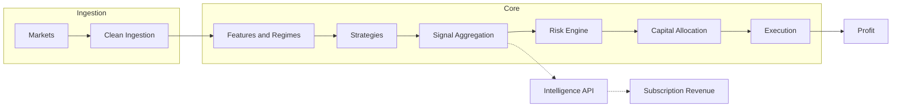

# Argus Master Plan

This document is the **single source of truth** for Argus: vision, current state, phased roadmap, strategies, regime/signal ideas, and principles. Update it whenever priorities or phases change so it stays authoritative for "what we're building and in what order."

---

## 1. Vision and Alpha

**Alpha** is the GPU engine: Heston-model Monte Carlo Probability of Profit (PoP) and IV surface anomaly detection. These are sophisticated, proprietary outputs that are safer to sell than raw price feeds. The long-term pipeline:

- **Trading pipeline:** Markets → clean ingestion → features & regimes → strategies → signal aggregation → risk engine → capital allocation → execution → profit.
- **Parallel product:** Argus Intelligence API exposes normalized bars, regimes, options intelligence, spread candidates, and signals for subscription revenue.

---

## 2. Current State

### Phase completion

| Phases | Status |
|--------|--------|
| 0–3B | **Done.** Event bus, bars, indicators, regime detection, strategy infra, timing filters, options pipeline, spread generation, tape, replay. |
| 4A Outcome Engine | **Done.** Bar outcomes, forward returns, run-up/drawdown, multi-horizon; deterministic backfills; `python -m src.outcomes`. |
| 4B Backtesting / Replay | **Done.** Replay harness, experiment runner, conservative execution model; replay packs with bars, outcomes, regimes, option snapshots. |
| 4C and beyond | **Not started.** Parameter search, portfolio risk, execution engine, strategy expansion, etc. |

### IV / snapshot / replay truth map

- **Bars and outcomes:** Alpaca (or configured bar provider).
- **Options snapshots:** Tastytrade REST.
- **IV source:** DXLink Greeks → GreeksCache → snapshot `atm_iv` at publish time.
- **Replay:** Uses snapshot `atm_iv`; no lookahead (gating by `recv_ts_ms`).
- **Storage:** Only ATM IV persisted; no DB bloat from tick-level Greeks.

**Remaining risk (ordering/timing):** Outcomes depend on GreeksCache being populated before the snapshot is published. Verify two edge cases: (1) cold start right after Argus boots (cache empty for a few minutes), (2) illiquid symbols / delayed Greeks (cache updates lag snapshots). E2E metrics should show `atm_iv` presence climbing after a short warmup.

---

## 3. Roadmap (Phases 0–10)

| Phase | Goal | Status | Deliverable |
|-------|------|--------|-------------|
| **0** | Deterministic data foundation | Done | Event bus, multi-exchange connectors, quote assembly, bar building, persistence, tape, replay, timestamp normalization, idempotent DB, replay determinism tests. |
| **1** | Indicator & feature engine | Done | EMA, RSI, MACD, VWAP, ATR, rolling vol, batch/incremental parity, deterministic serialization, warmup. |
| **2** | Regime detection | Done | Trend/range, volatility regimes, session classification, data quality flags, market vs symbol regimes, config hashing, restart warmup. |
| **3** | Strategy infrastructure | Done | SignalEvent schema, strategy base class, signal routing & ranking, persistence, tape capture, deterministic signal IDs. |
| **3A** | Timing filters | Done | Day-of-week, session, regime gating; deterministic emission. |
| **3B** | Options pipeline | Done | Options ingestion, chain normalization, spread generation, liquidity filtering, deterministic persistence, tape capture, replay validation. |
| **4A** | Outcome engine | Done | Forward returns, run-up, drawdown, multi-horizon outcomes, outcome DB storage, deterministic backfills. |
| **4B** | Backtesting engine | Done | Replay harness, position simulator, entry/exit modeling, transaction costs, slippage (conservative execution model). |
| **4C** | Parameter search & optimization | Next | Parameter sweeps, Monte Carlo runs, GPU simulations, regime sensitivity tests. |
| **5** | Portfolio risk engine | Future | Position sizing, exposure limits, drawdown controls, correlation awareness, strategy budgets. |
| **6** | Execution engine | Future | Broker integration, order routing, fill simulation, paper then live trading. |
| **7** | Strategy expansion | Future | Put spread selling, volatility plays, panic snapback, FVG, session momentum, crypto–ETF relationships, Polymarket. |
| **8** | Portfolio intelligence | Future | Strategy aggregation, signal voting, dynamic allocation, regime-based capital shifts. |
| **9** | Intelligence API product | Future | Expose bars, regimes, options intelligence, spread candidates, signals for subscription revenue. |
| **10** | Self-improving system | Future | Automatic idea testing, strategy mutation, performance pruning, adaptive weighting. |

**Current status:** Research engine complete through 4B. Next step: Phase 4C (measure outcomes at scale, kill bad strategies fast).

---

## 4. Strategies

### Primary (chosen direction)

1. **Overnight Session Momentum / Seasonality** — *Top priority starter.*  
   Capture predictable returns across session transitions (US close → Asia open, Asia → Europe, weekend effects, crypto handovers). Fits existing session classification, deterministic bars, replay, outcome engine. Assets: BTC, BTC ETFs (IBIT, BITO), possibly SPY overnight. Simple, robust, hard to overfit.

2. **VRP — Volatility Risk Premium / Put Spread Selling** — *Core options income.*  
   Sell put spreads when IV > realized vol, market not in risk-off collapse, liquidity acceptable. Theta decay and vol overpricing. IV now injected into snapshots; replay IV parity fixed. Target: IBIT, BITO, SPY, QQQ.

3. **Statistical Mean Reversion ("1-Min Snap")** — *Research.*  
   Trade short-term dislocations (ETF vs underlying BTC, futures vs ETF). Needs multi-symbol sync and basis calculation; more complex than session or VRP.

### Secondary / backlog

- **Fair Value Gap (FVG):** Trade gaps left by impulsive moves; consolidation vs breakaway vs rejection; medium–high automation difficulty.
- **9:30–9:35 opening candle:** Breakout of first 5-minute candle; tick-sensitive, not top priority.
- **8AM candle:** Institutional premarket; mentioned, not deeply pursued.
- **Friday high/low → Monday revisit:** Pattern saved for later testing.

### Areas where Argus will likely see trouble

These regimes or conditions are hard to handle well; expect difficulty in backtest, replay, or live behavior:

- **Panic snapback** — Fast reversals; execution and fill assumptions can break.
- **Session momentum** — Cross-session effects; timing and data alignment are fragile.
- **ETF vs underlying dislocations** — Multi-symbol sync, basis, and liquidity differ by venue.
- **Volatility spikes** — Regime shifts and option liquidity can invalidate assumptions.
- **Event-driven bars** — Noise bars and non-stationary behavior; avoid training on them; need filtering.

### API business

Long-term monetization: sell spreads, signals, and options intelligence via API. Not a strategy; separate product track.

---

## 5. Regime and Signal Methodologies

| Method | Role | Priority / caution |
|-------|------|---------------------|
| **BOCPD (Bayesian Online Change-Point Detection)** | Universal regime-switch primitive; gate premium-selling when P(change) &lt; x and vol regime stable; adaptive lookback from run length. | **Implement first.** Highest signal-to-complexity; addresses regime shifts (existential risk when selling spreads). |
| **Markov / HMM regime switching** | Classify state (low-vol grind, high-vol trend, chop); map states → allowed strategy families. | Use as **one vote** among features; require confirmation from vol + microstructure; not sole driver. |
| **Hawkes / self-exciting order flow** | Microstructure “risk-on / risk-off”; shock detector; execution risk (slippage, adverse selection). | Optional until tape / order-flow depth; needs high-frequency prints. |
| **Signature transform** | Path features for regime/trend/chop classification; feed into regime gate or position sizing. | Phase 2/3; implementation complexity and overfit risk. |
| **Multifractal (MFDFA etc.)** | Risk filter: unstable scaling → reduce size / stop selling premium. | Slow-moving; weekly/monthly risk posture rather than intraday trigger. |
| **Fisher transform** | Local oscillator; Gaussianizing bounded indicators for mean-reversion thresholds. | **Feature only**, not regime gate; prone to pretty backtests that vanish after costs and regime shift. |

---

## 6. Principles (Non-Negotiables)

- **Avoid noise bars.** Not all bars are equal; prefer volume/information bars and regime filtering; event-driven bars matter for feature engineering.
- **Replay must be honest.** No mid-price fills, no lookahead bias, no optimistic fills; execution model must be pessimistic.
- **Determinism.** Same input → same output for all systems (bars, indicators, regimes, signals, outcomes).
- **Regime detection is critical.** Volatility, liquidity, risk-on/off, trend acceleration must feed strategy gating and risk.

---

## 7. How to Update This Doc

- **When a phase completes:** Set its status to Done and add a one-line “Completed: …” if useful.
- **When strategy priority changes:** Update Primary / Secondary and any implementation-order notes.
- **When adding a strategy or regime method:** Add under the right section and set status (research / planned / in progress).
- **When IV/replay/truth map changes:** Update §2 and any phase deliverable that touches snapshots or outcomes.

---

## 8. References

| Document | Description |
|----------|-------------|
| [docs/outcome_semantics.md](docs/outcome_semantics.md) | Bar outcome window definition, metrics, statuses, quantization, CLI for backfill and coverage. |
| [docs/replay_pack_and_iv_summary.md](docs/replay_pack_and_iv_summary.md) | Replay pack contents, IV from provider vs derived, checklist for replay + IV + non-zero experiments. |
| [ONBOARDING_ROADMAP.md](ONBOARDING_ROADMAP.md) | Learning path through the codebase: architecture, data flow, config, soak/tape, glossary. |
| [argus_strategy_backlog.md](argus_strategy_backlog.md) | Idea parking lot and strategy evaluation framework; master plan is authoritative for priority order. |
